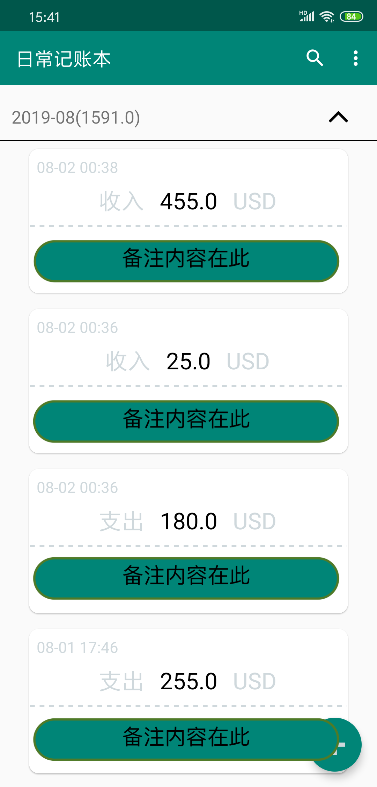
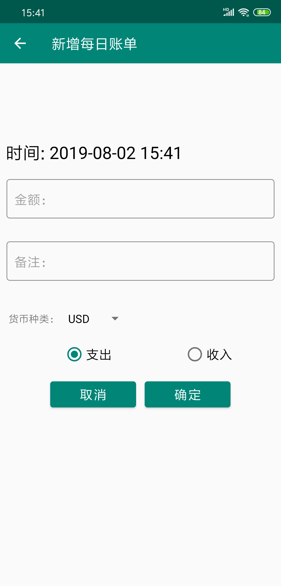
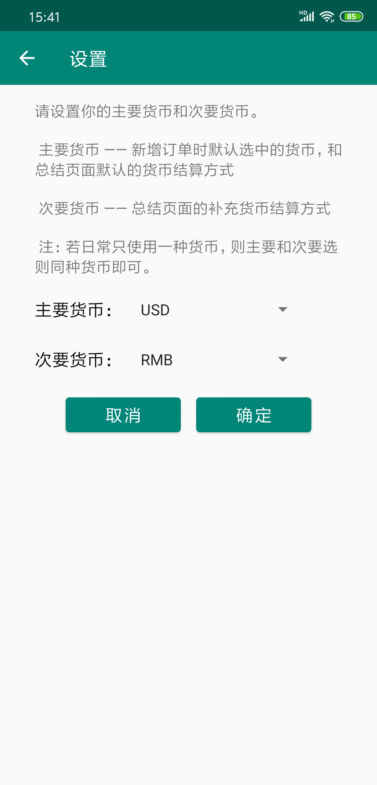
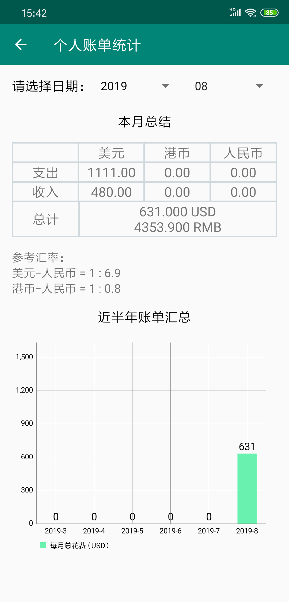

# account_book

[中文版](./README_ch.md)

[English version](./README.md)

## Download

[here](https://github.com/xkw168/account_book/releases)

## Introduction

1、Main Page(show all the transactions you have)

2、create a new transaction

* the APP will generate the time automatically
* amount must be filled in
* comment(briefly describe this transaction, optional)
* currency & paid/received

3、Setting

set the primary and secondary currency

4、 monthly summary

display the statistic data in both table and histogram, the app will query the latest currency exchange rate at **run time**

## Declaration

All data are stored locally, no internet needed.
