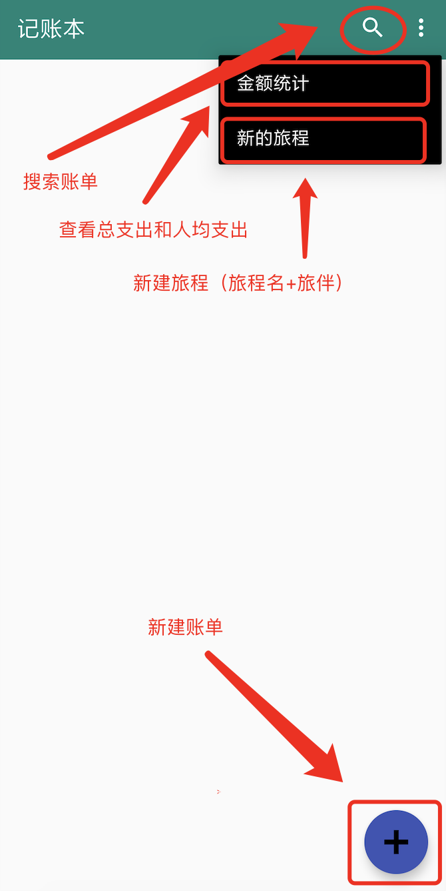
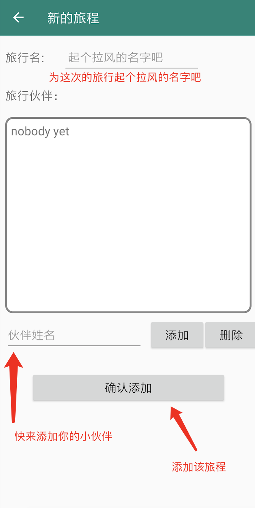

# account_book

一个旅行记账软件，适合多人AA出行。

注：由于需求变化，现在最新版APP为个人日常记账本，支持多种货币和月度统计功能，新版APP详细介绍请看[这里](https://github.com/xkw168/account_book/blob/master/README_NEW.md)

## 软件下载

---

[here](https://github.com/xkw168/account_book/releases)

## 软件使用说明

---

1、软件首页如图

支持根据关键词搜索账单，菜单栏可以统计金额和新建旅程，新建旅程之后，通过+可以新建账单

以日为单位，显示本次旅程所有账单

2、新建旅程

首先为该旅程起一个拉风的名字

然后添加所有的旅途小伙伴（为了后面记账方便）

最后提交新的旅程

3、新建账单

时间是系统自动生成的

金额和付款人是必填项（这里默认金额都是所有人AA）

备注选填（可以简短描述一下该笔支出）

## 声明

---

本软件所有数据均保存在用户本地，不涉及任何网络操作，请放心使用！
如发现bug（或者希望改进的地方），欢迎在issue里面报告（尽可能详细描述，谢谢）
